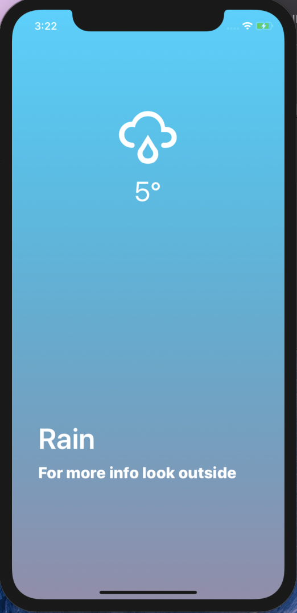
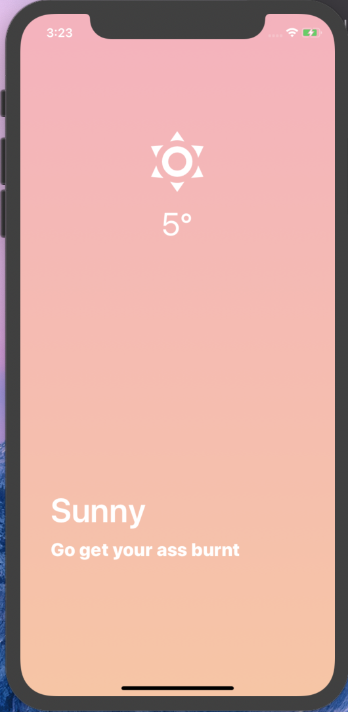
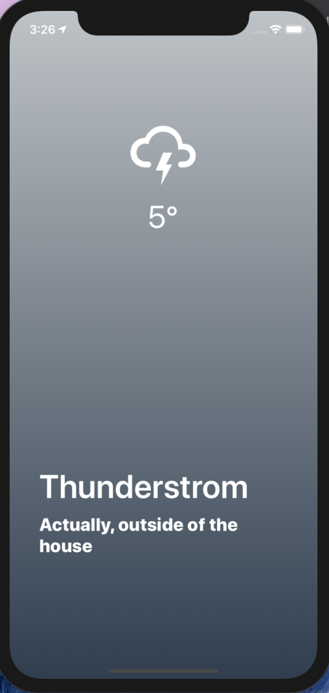
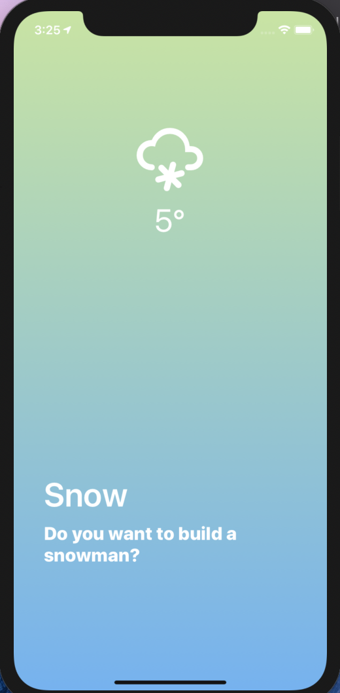

## ChromeApp
#### 1. 바닐라 JS로 크롬 앱 만들기

- 참고 강의 : https://academy.nomadcoders.co/p/javascript-basics-for-absolute-beginners-kr

- 설명 : 현재 시간, 이름, 할일 목록, 날씨를 알려주는 크롬 앱 

#### 2. React Native로 날씨앱 만들기

- 참고 강의 https://academy.nomadcoders.co/p/fucking-react-native-apps

- 설명 : 현재 위치를 받아와서 위치에 따른 날씨를 보여주고, 각 날씨에 따라 다른 스타일을 보여주는 앱

- 

  

  

  

